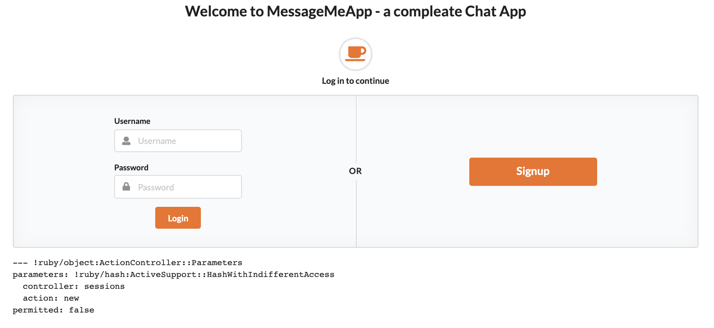
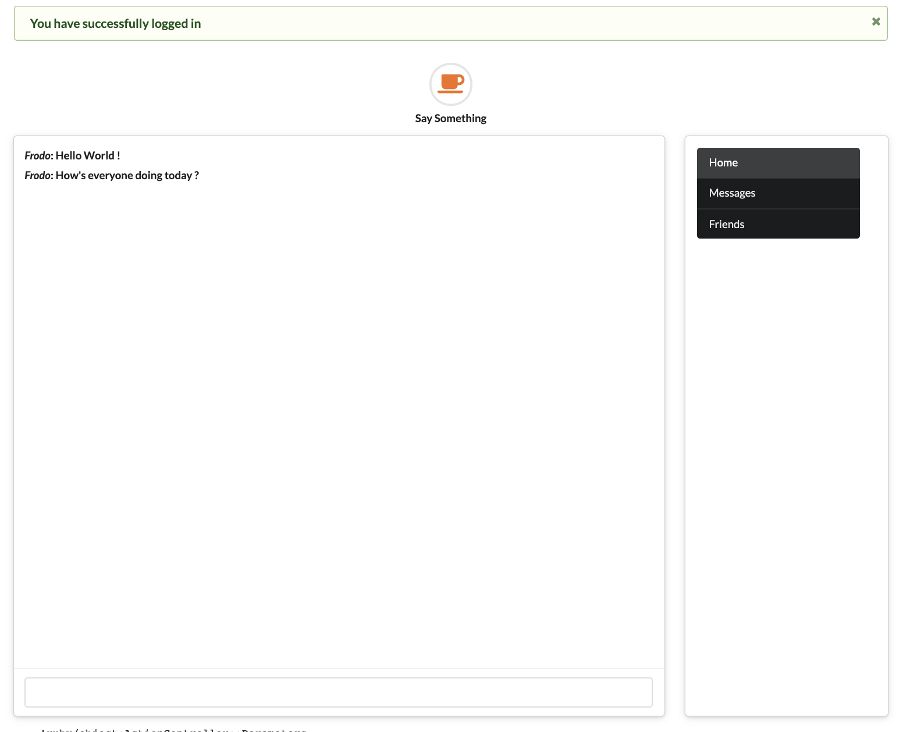

# Message Me App

**Message Me Webb** App been build with Ruby on Rails framework and coded using **Ruby** as a language. Bootstrap been used for main UI elements to add more modern feel to web app.  
**Message Me App** is a simple web app that enables users to send and receive messages using live messaging service that been enabled via actionable. Login functionality been added to enable data privacy when using web app.

_The inspiration behind the project:_ Learn Ruby on Rails framework and deliver MVP.

See the full project on [GitHub.][1]

### Message Me App

[Specification](#specification) | [Tech Stack](#tech-stack) | [Installation](#installation) | [Development Process](#development-process) | [Further development](#further-development)

# Specification

The app enables users to use live messaging service and communicate with other App users.
The user must log in to use the service, once that done user able to chat with other App users by sending messages that enable live chat.
Once the user is logged in, chat history and users that posted messages could be seen on the main page.

# Tech Stack:

- [Ruby on Rails](https://rubyonrails.org/) to deliver full MVC.
- [PostgreSQL](https://www.postgresql.org/) as database for data storage. User details and messages.
- [Bootstrap](https://getbootstrap.com/) & CSS for styling.

# Installation

- Clone this repository
  `$ git clone https://github.com/EdAncerys/message_me_app`
- Navigate to local repository
  `$ cd rmessage_me_app`
- Install all dependencies
  `$ brew bundle`
- Add/install database structure locally.  
  `$ rails db:create:all`  
  `$ rails db:migrate`
- Start the server
  `$ rails s`
- Navigate to [http://localhost:3000](http://localhost:3000) in your browser

# Development Process

During development process I used an agile development methodologies of using git, commit messages, git branches, merges and regular code refactor.

## MVP

My aim for the MVP was to have an interface with login/logout functionality, and a UI with messaging capabilities where user can interact with other App users.

## User Stories

```
As a user
So I can use the message app
I want to be able to log in
```

```
As a user
So I can securely leave my account
I want to be able to logout
```

```
As a user
So I can interact with other app users
I want to be able to sent messages
```

## Message Me Web App UI

### Login page/view

<p align="center">
    

    *User login view*

</p>

### Home page view

<p align="center">
      
    
    *Home page view*
</p>

# Further development

To extend app functionality following features can be added:

- Add feature to delete messages
- Add feature to like other user messages
- Add feature to share files, like photos with other app users
- Add feature to add/follow friends

[1]: https://github.com/EdAncerys/message_me_app
